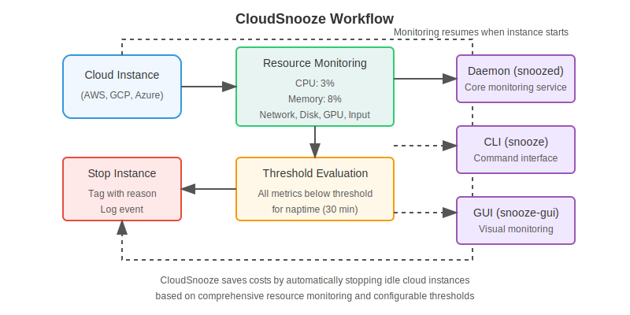

<p align="center">
  
</p>

# CloudSnooze

<p align="center">
  <strong>Automatically stop idle cloud instances and save costs</strong>
</p>

<p align="center">
  <a href="#features">Features</a> •
  <a href="#how-it-works">How It Works</a> •
  <a href="#installation">Installation</a> •
  <a href="#quick-start">Quick Start</a> •
  <a href="#documentation">Documentation</a> •
  <a href="#building-from-source">Building</a> •
  <a href="#license">License</a> •
  <a href="https://scttfrdmn.github.io/cloudsnooze/">Website</a>
</p>

<p align="center">
  <a href="https://github.com/scttfrdmn/cloudsnooze/blob/main/LICENSE"></a>
  <a href="https://github.com/scttfrdmn/cloudsnooze/releases"></a>
  <a href="https://go.dev/dl/"></a>
  
  
</p>
<p align="center">
  <a href="https://github.com/scttfrdmn/cloudsnooze/actions/workflows/build.yml"></a>
  <a href="https://cloudsnooze.io/docs/"></a>
  
  
  <a href="https://github.com/scttfrdmn/cloudsnooze/graphs/contributors"></a>
</p>

## Features

- **Low Resource Usage**: Lightweight Go daemon with minimal impact on the monitored instance
- **Comprehensive Monitoring**: Tracks CPU, memory, network, disk I/O, user input, and GPU activity
- **Real User Activity Detection**: Monitors actual keyboard and mouse usage, not just logins
- **Cloud Provider Agnostic**: Initially supports AWS, with design for future expansion
- **Cross-Architecture Support**: Works on both x86_64 and ARM64 instances
- **Multiple Interfaces**: CLI tool, GUI application, and daemon
- **Instance Tagging**: Records when and why instances were stopped
- **Enhanced Logging**: Multiple logging options for visibility and tracking

## How It Works

CloudSnooze monitors system resource usage and automatically stops instances when all metrics remain below specified thresholds for a defined period (the "naptime"). This saves costs by ensuring you only pay for compute resources when they're actually needed.

The system consists of three components:
1. **Daemon (`snoozed`)** - Monitors resources and stops instances
2. **CLI (`snooze`)** - Command-line interface for management
3. **GUI (`snooze-gui`)** - Graphical interface for visual monitoring

<p align="center">
  
</p>

## Installation

### macOS (Homebrew)

```bash
# Install CloudSnooze
brew tap scttfrdmn/cloudsnooze
brew install cloudsnooze

# Start the service
brew services start cloudsnooze

# Check status
snooze status
```

### Windows (Chocolatey)

```powershell
# Install Chocolatey if not already installed
# See https://chocolatey.org/install for instructions

# Install CloudSnooze
choco install cloudsnooze

# Check status
snooze status
```

### Windows (MSI Installer)

1. **Download** the MSI installer from [GitHub Releases](https://github.com/scttfrdmn/cloudsnooze/releases)
2. **Run** the installer (Administrator privileges required)
3. **Verify** installation with `snooze status` in a new command prompt

### Linux Packages

1. **Download the appropriate package for your system**:
   - For Debian/Ubuntu (x86_64): `cloudsnooze_1.0.0_amd64.deb`
   - For Debian/Ubuntu (ARM64): `cloudsnooze_1.0.0_arm64.deb` 
   - For RHEL/Fedora/Amazon Linux (x86_64): `cloudsnooze-1.0.0-1.x86_64.rpm`
   - For RHEL/Fedora/Amazon Linux (ARM64): `cloudsnooze-1.0.0-1.aarch64.rpm`

2. **Install the package**:
   ```bash
   # Debian/Ubuntu
   sudo dpkg -i cloudsnooze_1.0.0_*.deb
   
   # RHEL/Fedora/Amazon Linux
   sudo rpm -i cloudsnooze-1.0.0-1.*.rpm
   ```

3. **Configure AWS IAM permissions** (required for AWS instances):
   See the [IAM Configuration Guide](docs/iam-policy-guide.md)

4. **Enable and start the service**:
   ```bash
   sudo systemctl enable snoozed
   sudo systemctl start snoozed
   ```

## Quick Start

After installation, CloudSnooze runs with default settings that work for most scenarios. Here's how to verify and customize:

1. **Check status**:
   ```bash
   snooze status
   ```

2. **View default configuration**:
   ```bash
   snooze config list
   ```

3. **Adjust thresholds** (if needed):
   ```bash
   # Set CPU threshold to 5%
   snooze config set cpu-threshold 5.0
   
   # Set memory threshold to a higher value
   snooze config set memory-threshold 40.0
   
   # Adjust naptime to 20 minutes
   snooze config set naptime 20
   ```

4. **View logs**:
   ```bash
   snooze logs
   ```

## Monitoring Metrics and Thresholds

CloudSnooze monitors these metrics to determine instance idle state:

| Metric | Parameter | Description | Default | Units |
|--------|-----------|-------------|---------|-------|
| CPU Usage | `cpu_threshold_percent` | Average CPU utilization across all cores | 10.0 | Percentage (0-100) |
| Memory Usage | `memory_threshold_percent` | Percentage of used memory relative to total memory | 30.0 | Percentage (0-100) |
| Network Traffic | `network_threshold_kbps` | Combined ingress/egress network traffic | 50.0 | Kilobytes per second |
| Disk I/O | `disk_io_threshold_kbps` | Combined read/write disk operations | 100.0 | Kilobytes per second |
| Input Activity | `input_idle_threshold_secs` | Time since last keyboard/mouse activity | 900 | Seconds |
| GPU Usage | `gpu_threshold_percent` | Average GPU utilization across all detected GPUs | 5.0 | Percentage (0-100) |

An instance is considered idle when **all** metrics remain below their thresholds for the duration specified by `naptime_minutes` (default: 30 minutes).

## Documentation

- [Overview](docs/design/overview.md) - Project overview and architecture
- [Data Model](docs/design/data-model.md) - Core data structures
- [Command Structure](docs/design/command-structure.md) - CLI commands and usage
- [Deployment Templates](docs/design/deployment-template.md) - CloudFormation, Terraform, etc.
- [Integration Guide](docs/integration/README.md) - API reference and integration guide
- [Building and Packaging](docs/building/packaging.md) - Package building instructions

**For full documentation, visit our [documentation website](https://scttfrdmn.github.io/cloudsnooze/docs/).**

## Building from Source

To build CloudSnooze from source:

```bash
# Clone repository
git clone https://github.com/scttfrdmn/cloudsnooze.git
cd cloudsnooze

# Build daemon
cd daemon
go build -o snoozed
cd ..

# Build CLI
cd cli
go build -o snooze
cd ..

# Build GUI (requires Node.js)
cd ui
npm install
npm run build
cd ..
```

See the [Development Guide](docs/development-guide.md) for detailed build instructions and requirements.

## Contributing

Contributions are welcome! Please feel free to submit a Pull Request.

1. Fork the repository
2. Create your feature branch (`git checkout -b feature/amazing-feature`)
3. Commit your changes (`git commit -m 'Add some amazing feature'`)
4. Push to the branch (`git push origin feature/amazing-feature`)
5. Open a Pull Request

### Reporting Issues

CloudSnooze makes it easy to report issues directly from the CLI:

```bash
# Report a bug
snooze issue -type bug -title "Your issue title"

# Request a feature
snooze issue -type feature -title "Add support for XYZ"
```

This opens a pre-filled GitHub issue form in your browser with system information to help with troubleshooting.

For more information, see the [Issue Reporting Guide](docs/integration/reporting-issues.md).

## License

This project is licensed under the Apache License, Version 2.0 - see the [LICENSE](LICENSE) file for details.

## Acknowledgments

- Thanks to all the contributors who have helped with development
- Inspired by the need to save cloud costs automatically
- Built with Go and Electron
